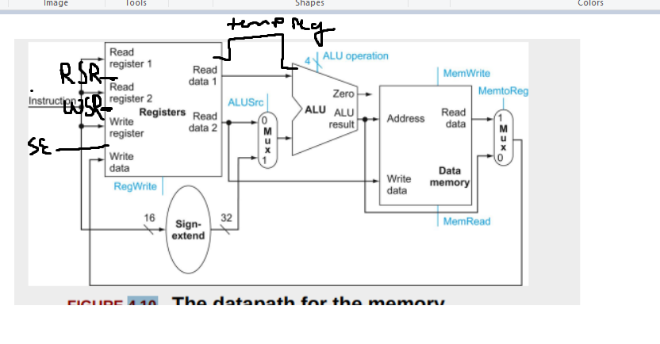

Review textbook Chapter 4, sections 4.1 through 4.4.

#1 (textbook exercise 4.1)
Consider the following instruction:
Instruction: and rd, rsl, rs2
Interpretation: Reg[rd] = Reg[rs1] AND Reg[rs2]
#1.a <§4.3> What are the values of control signals generated by the control in Figure 4.10 for this instruction?
#1.b <§4.3> Which resources (blocks) perform a useful function for this instruction?
#1.c <§4.3> Which resources (blocks) produce no output for this instruction? Which resources produce output that is not used?

#2 (textbook exercise 4.5)
In this exercise, we examine in detail how an instruction is executed in a single-cycle datapath. Problems in this exercise refer to a clock cycle in which the processor fetches the following instruction word: 0x00c6ba23.
#2.a <§4.4> What are the values of the ALU control unit’s inputs for this instruction?
#2.b <§4.4> What is the new PC address after this instruction is executed? Highlight the path through which this value is determined.
#2.d <§4.4> For each mux, show the values of its inputs and outputs during the execution of this instruction. List values that are register outputs at Reg [xn].
#2.e  <§4.4> What are the input values for the ALU and the two add units?
#2.f  <§4.4> What are the values of all inputs for the registers unit?

#3 textbook exercise (4.12)
Examine the difficulty of adding a proposed swap rs, rt instruction to MIPS.
Interpretation: Reg[rt] = Reg[rs]; Reg[rs] = Reg[rt]
#3.a <§4.4> Which new functional blocks (if any) do we need for this instruction?
#3.b <§4.4> Which existing functional blocks (if any) require modification?
#3.c <§4.4> What new data paths do we need (if any) to support this instruction?
#3.d <§4.4> What new signals do we need (if any) from the control unit to support this instruction?
#3.e <§4.4> Modify Figure 4.21 in Chapter 4 to demonstrate an implementation of this new instruction.

## Question 1 
a. Control Signals
RegWrite = 1 (since we are writing to a register)
ALUSrc = 0 (no immediates, read from registers)
ALU_Operation = 10
MemWrite = 0 (not writing to memory)
MemRead = 0 (not reading from memory)
MemToReg = 0 (not transferring data from memory)

b.  
The register file contains and reads the three registers
The instruction memory fetches the action `and rd, rsl, rs2`
The ALU performs the AND
the Control Unit directs operations
ALUSrc mux chooses the ALU input

c. 
Sign extend is not doing anything
MemToReg mux is essentially useless (basically all of data memory is not used)'

## Question 2

Break down 0x00c6ba23 -> 0000 0000 1100 0110 1011 1010  0010 0011

opcode = 0000 00 (R-type instruction)
rs = 00110
rt = 00110
rd = 10111
shamt = 01000
funct = 100011 (35 in decimal, 23 in hex) -> Subtract Unsigned

Control Signals
RegWrite = 1 (since we are writing to a register)
ALUSrc = 0 (no immediates, read from registers)
ALU_Operation = 10
MemWrite = 0 (not writing to memory)
MemRead = 0 (not reading from memory)
MemToReg = 0 (not transferring data from memory)

New PC Address
PC + 4, 
Current PC starts at the instruction for subu -> sent to the adder that the program counter uses which increments 4, and the new output is PC+4

subu $s7, $a2, $a2

ALUSrc 
Inputs = Reg[$a2] & SignExtendImm (not used so don't care)
Control Signal = ALUSrc (0)
Output = Reg[$a2]

MemToReg
Inputs = ALUResult (Which is Reg[$a2]-Reg[$a2] = 0) and MemoryReadData (Garbage, since not used)
Control Signal = 0
Output = 0

Input values for ALU and add units -> PC address to increment by instruction, and also (Reg[$a2] and !Reg[$a2]+1)

Input to register unit:
rs = $a2, rt = $a2, Write Register = $s7, Write Data = 0, RegWrite = 1

## Question 3

You would need a new functional block to temporarily store the value of a register

Existing functional blocks that require modification include the register file, which needs to suppoort writing and reading to another register.

The Control Unit needs to sequence RegWrite signals in order to prevent data from being lost

We would need a new data path to go through a temporary register

We need a signal for when to switch to the second register to write, and a new "SwapEnable" in addition to Write Enable

